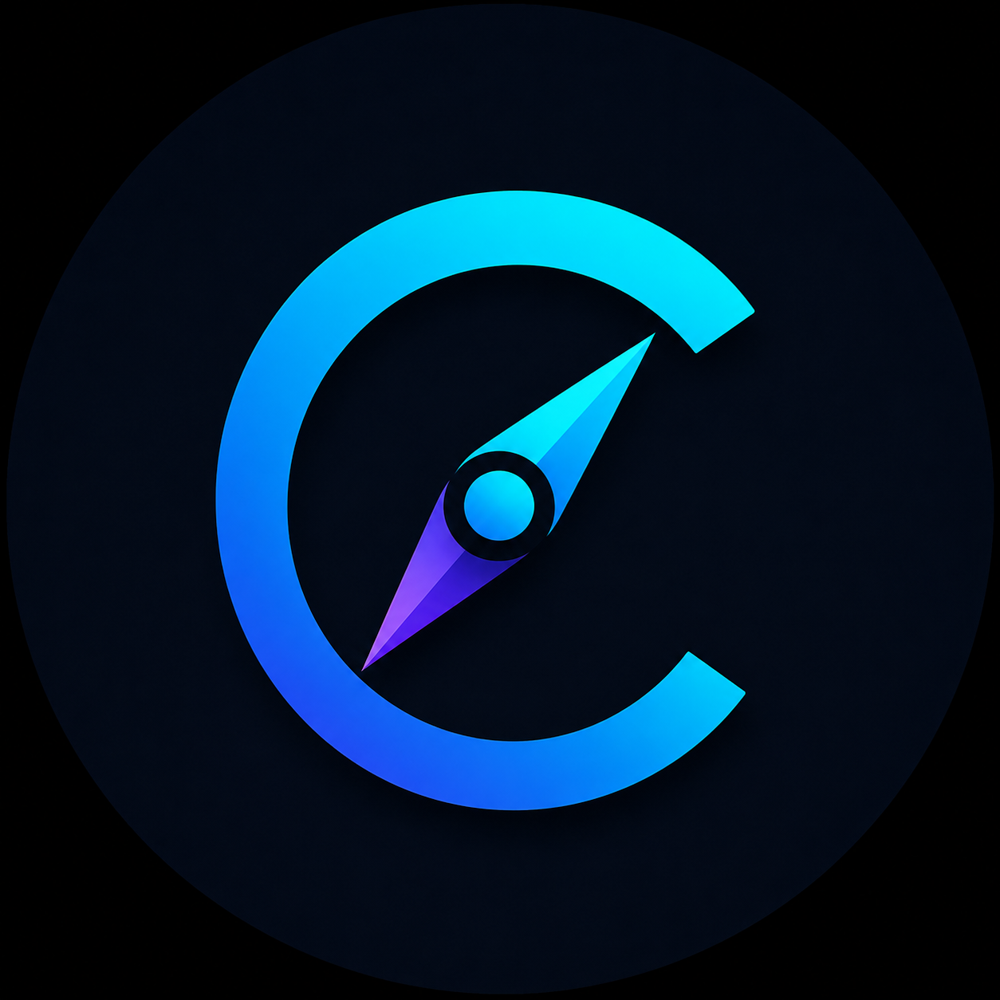

<p align="center">
  
</p>

<h1 align="center">CareerCompass AI</h1>

<p align="center">
  <strong>Career Intelligence Platform</strong>
</p>

<p align="center">
  Plataforma modular de inteligência de carreira para análise de currículo, descoberta de oportunidades, avaliação de compatibilidade, inteligência ATS, recomendações de candidatura, tailoring de CV, preparação para entrevistas e geração de assessment profissional.
</p>

<p align="center">
  
  
  
  
</p>

---

## Sobre o CareerCompass AI

O **CareerCompass AI** é uma plataforma de inteligência de carreira desenvolvida para transformar informações profissionais em análises estruturadas que apoiem decisões relacionadas a **recolocação, candidatura, desenvolvimento profissional e preparação para processos seletivos**.

A plataforma permite utilizar um perfil profissional padrão ou carregar um currículo em **PDF ou DOCX**. A partir desse conteúdo, módulos especializados analisam competências, experiências, senioridade, ferramentas, metodologias, evidências profissionais e aderência a oportunidades.

A proposta vai além de um analisador de currículo isolado. O projeto conecta diferentes etapas da jornada profissional em um fluxo integrado:

> **Perfil → Mercado → Oportunidade → ATS → Estratégia de candidatura → Entrevista → Assessment**

O CareerCompass AI utiliza uma **arquitetura modular inspirada em sistemas multiagente**, na qual cada engine possui uma responsabilidade específica e compartilha contexto com os demais componentes.

---

## 🚀 Live Demo

Acesse o CareerCompass AI:

https://careercompass-intelligence.streamlit.app

---

## ✨ Principais funcionalidades

### 📄 Upload e análise de currículo

O usuário pode carregar seu currículo em:

- PDF
- DOCX

O conteúdo é extraído e transformado em um perfil profissional utilizado pelos demais módulos.

Também existe um **perfil padrão** para demonstração e testes.

---

### 🧠 Profile Engine

O **Profile Engine** transforma o conteúdo textual do currículo em uma representação estruturada do perfil profissional.

Entre as dimensões analisadas estão:

- identificação do candidato;
- áreas profissionais;
- senioridade;
- hard skills;
- ferramentas e tecnologias;
- competências de gestão;
- metodologias;
- idiomas;
- evidências de atuação e resultados.

Esse perfil estruturado funciona como camada de inteligência compartilhada pelos demais módulos.

---

### 🔎 Scout — Radar de Oportunidades

O **Scout** analisa as competências presentes no perfil ativo e identifica caminhos profissionais com maior aderência.

O ranking pode apresentar:

- cargo ou caminho profissional;
- percentual de aderência;
- classificação;
- competências encontradas;
- justificativa da recomendação.

O objetivo é responder:

> **Onde este perfil profissional pode gerar mais valor?**

---

### 🎯 Curator — Career Fit

O **Curator** compara o perfil profissional com uma oportunidade específica.

A análise considera:

- requisitos identificados na vaga;
- pesos por categoria;
- prioridade dos requisitos;
- senioridade;
- cobertura de competências;
- aderências;
- gaps de evidência;
- equivalências profissionais controladas.

O matching utiliza evidências textuais e relações profissionais controladas para reduzir falsos negativos. Por exemplo, evidências de **Scrum ou Kanban** podem sustentar um requisito mais amplo de **Agile**, sem tratar conceitos diferentes como simples sinônimos.

O objetivo é apoiar a decisão anterior à candidatura:

> **Quanto meu perfil realmente combina com esta oportunidade?**

---

### 🧠 ATS Intelligence

O **ATS Engine** avalia a candidatura sob uma perspectiva de cobertura de requisitos e palavras-chave relevantes.

O módulo apresenta indicadores como:

- ATS Score;
- cobertura de keywords;
- cobertura de requisitos obrigatórios;
- cobertura de diferenciais;
- aderência de senioridade;
- requisitos encontrados;
- gaps obrigatórios;
- gaps preferenciais;
- resumo por categoria.

O score é um **indicador interno do modelo** e não representa a pontuação real de qualquer ATS comercial específico.

---

### 🧭 Recommendation Engine

O **Recommendation Engine** transforma o diagnóstico técnico em orientação de candidatura.

As recomendações podem abordar:

- pontos que merecem maior destaque;
- gaps obrigatórios;
- competências comprovadas;
- posicionamento profissional;
- preparação para entrevista;
- priorização de evidências no currículo.

O motor segue um princípio de segurança de carreira:

> **Não recomendar como experiência aquilo que não possui evidência no perfil analisado.**

---

### 📋 CV Tailoring

O **CV Tailoring Engine** gera uma estratégia de adaptação do currículo para a oportunidade analisada.

O módulo pode sugerir:

- headline profissional;
- resumo direcionado;
- competências prioritárias;
- keywords ATS seguras;
- evidências que merecem maior destaque;
- gaps que não devem ser inventados;
- recomendações por seção do currículo.

A lógica também evita redundâncias semânticas na headline, como repetir simultaneamente **Gerente de Projetos** e **Gestão de Projetos**.

O objetivo não é reescrever a trajetória do candidato, mas **reposicionar evidências reais de forma mais aderente à oportunidade**.

---

### 🎤 Coach — Simulador de Entrevistas Contextualizado

O **Coach** conduz uma entrevista profissional estruturada em múltiplas etapas.

Quando iniciado a partir de uma oportunidade já analisada, o módulo recebe o contexto da vaga, do ATS e do Tailoring, permitindo gerar perguntas contextualizadas.

O Coach diferencia tipos de pergunta, incluindo:

- apresentação;
- experiência;
- competências;
- comportamental;
- motivação;
- encerramento.

A avaliação considera critérios específicos para cada tipo de pergunta.

A estrutura **STAR** é tratada como obrigatória principalmente nas perguntas comportamentais, evitando penalizar respostas de motivação ou apresentação por um critério inadequado.

Entre os elementos avaliados estão:

- clareza;
- evidências;
- aderência à pergunta;
- responsabilidade;
- impacto;
- competências;
- resultados quantitativos;
- estrutura narrativa.

Após cada etapa, o candidato recebe feedback e recomendações de melhoria.

---

### 📋 Assessment — Relatório Profissional

O módulo de **Relatório Profissional** consolida as informações detectadas no currículo em um diagnóstico estruturado.

O assessment pode apresentar:

- identificação do candidato;
- fonte analisada;
- data da análise;
- senioridade;
- resumo executivo;
- áreas profissionais;
- hard skills;
- ferramentas;
- competências de gestão;
- metodologias;
- idiomas;
- evidências profissionais;
- principais forças;
- pontos de atenção;
- caminhos profissionais;
- recomendações.

O relatório pode ser exportado e utilizado como apoio a processos de:

- recolocação profissional;
- orientação de carreira;
- preparação para entrevistas;
- revisão de currículo;
- identificação de competências;
- planejamento de desenvolvimento profissional.

---

## 🧩 Arquitetura

```text
                         ┌───────────────────────┐
                         │       CURRÍCULO       │
                         │       PDF / DOCX      │
                         └───────────┬───────────┘
                                     │
                                     ▼
                         ┌───────────────────────┐
                         │     Resume Parser     │
                         │   Extração de texto   │
                         └───────────┬───────────┘
                                     │
                                     ▼
                         ┌───────────────────────┐
                         │     Profile Engine    │
                         │  Perfil estruturado   │
                         └───────────┬───────────┘
                                     │
                  ┌──────────────────┼──────────────────┐
                  │                  │                  │
                  ▼                  ▼                  ▼
           ┌────────────┐     ┌────────────┐     ┌────────────┐
           │   Scout    │     │  Curator   │     │ Assessment │
           │   Radar    │     │ Career Fit │     │  Report    │
           └────────────┘     └──────┬─────┘     └────────────┘
                                     │
                                     ▼
                              ┌──────────────┐
                              │ ATS Engine   │
                              │ Intelligence │
                              └──────┬───────┘
                                     │
                     ┌───────────────┴────────────────┐
                     │                                │
                     ▼                                ▼
              ┌──────────────┐                ┌──────────────┐
              │Recommendation│                │ CV Tailoring │
              │    Engine    │                │    Engine    │
              └──────┬───────┘                └──────┬───────┘
                     │                                │
                     └───────────────┬────────────────┘
                                     │
                                     ▼
                              ┌──────────────┐
                              │    Coach     │
                              │  Interview   │
                              └──────┬───────┘
                                     │
                                     ▼
                              ┌──────────────┐
                              │ Report / PDF │
                              │   Markdown   │
                              └──────────────┘
```

---

## 🤖 Agentes, engines e componentes

| Componente | Responsabilidade |
|---|---|
| **Resume Parser** | Extrair conteúdo de currículos PDF e DOCX |
| **Profile Engine** | Estruturar competências, senioridade e evidências profissionais |
| **Scout Engine** | Identificar caminhos profissionais aderentes |
| **Curator Engine** | Calcular Career Fit e analisar requisitos da oportunidade |
| **ATS Engine** | Avaliar cobertura ATS, obrigatórios, keywords e senioridade |
| **Recommendation Engine** | Transformar gaps e forças em recomendações acionáveis |
| **CV Tailoring Engine** | Criar estratégia segura de adaptação do currículo |
| **Coach Engine** | Simular entrevistas e avaliar respostas conforme o tipo de pergunta |
| **Report Engine** | Consolidar o diagnóstico profissional |
| **PDF Engine** | Gerar versão exportável do assessment |
| **Maestro AI** | Conceito de coordenação entre módulos especializados |

---

## 🔄 Pipeline de Career Intelligence

```text
Currículo
   ↓
Resume Parser
   ↓
Profile Engine
   ↓
Perfil profissional estruturado
   ↓
┌───────────────────────────────┐
│ Scout — Radar de Oportunidades│
└───────────────────────────────┘
   ↓
Vaga específica
   ↓
Career Fit
   ↓
ATS Intelligence
   ↓
Recommendation Engine
   ↓
CV Tailoring
   ↓
Entrevista contextualizada
   ↓
Assessment profissional
   ↓
PDF / Markdown
```

A integração permite que uma oportunidade analisada seja reutilizada pelo Coach, preservando o contexto da vaga durante a preparação para entrevista.

---

## 🛠️ Tecnologias

- Python 3.11+
- Streamlit
- Pandas
- python-docx
- pypdf
- ReportLab
- Git
- GitHub

---

## 📁 Estrutura do projeto

```text
CareerCompass-AI/
│
├── app/
│   ├── main.py
│   ├── ats_engine.py
│   ├── coach_engine.py
│   ├── curator_engine.py
│   ├── cv_tailoring_engine.py
│   ├── pdf_engine.py
│   ├── profile_engine.py
│   ├── recommendation_engine.py
│   ├── report_engine.py
│   ├── resume_parser.py
│   └── scout_engine.py
│
├── data/
│   ├── personality-quiz.md
│   └── user-profile.md
│
├── personas/
│   ├── coach.md
│   ├── curator.md
│   ├── maestro.md
│   └── scout.md
│
├── skills/
│   └── dispatch.md
│
├── AGENTS.md
├── careercompass-icon.png
├── README.md
├── requirements.txt
├── .gitignore
└── .env
```

> O arquivo `.env` deve permanecer fora do versionamento.

---

## 🚀 Como executar

Clone o repositório:

```bash
git clone https://github.com/MCLG1661/CareerCompass-AI.git
```

Entre na pasta:

```bash
cd CareerCompass-AI
```

Crie um ambiente virtual:

```powershell
python -m venv .venv
```

Ative o ambiente no Windows PowerShell:

```powershell
.venv\Scripts\Activate.ps1
```

Instale as dependências:

```powershell
pip install -r requirements.txt
```

Execute a aplicação:

```powershell
python -m streamlit run app/main.py
```

Acesse:

```text
http://localhost:8501
```

---

## 🎯 Visão de produto

O CareerCompass AI foi concebido como uma **Career Intelligence Platform**, e não apenas como um analisador de currículo.

A arquitetura conecta diferentes dimensões da jornada profissional:

> **Perfil → Mercado → Oportunidade → Aderência → Estratégia → Preparação**

A proposta é transformar dados profissionais não estruturados em evidências úteis para apoiar decisões de carreira.

O sistema foi desenhado para manter separadas três ideias importantes:

1. **Competência exigida pela vaga**
2. **Evidência encontrada no currículo**
3. **Recomendação de posicionamento**

Essa separação reduz o risco de transformar otimização de currículo em fabricação de experiência.

---

## 📊 Interpretação dos scores

Os scores apresentados pelo CareerCompass AI são indicadores internos produzidos pelas regras e pesos do próprio modelo.

Eles devem ser utilizados para:

- comparar aderência relativa;
- identificar forças e gaps;
- orientar revisão do currículo;
- priorizar preparação para entrevista;
- apoiar decisões de candidatura.

Eles **não representam probabilidades reais de contratação**, aprovação ou entrevista.

O **ATS Score** também não pretende reproduzir o algoritmo proprietário de plataformas comerciais de recrutamento.

---

## 🗺️ Roadmap

### Implementado

- [x] Interface Streamlit
- [x] Arquitetura modular
- [x] Perfil profissional padrão
- [x] Upload de currículo
- [x] Leitura de PDF
- [x] Leitura de DOCX
- [x] Profile Engine
- [x] Identificação automática do candidato
- [x] Detecção de senioridade
- [x] Detecção estruturada de competências
- [x] Scout — Radar de Oportunidades
- [x] Curator — Career Fit multidimensional
- [x] Pesos por categoria e prioridade
- [x] Equivalências profissionais controladas
- [x] ATS Intelligence
- [x] Recommendation Engine
- [x] CV Tailoring
- [x] Proteção contra inclusão de competências sem evidência
- [x] Coach — Simulador de Entrevistas
- [x] Entrevista contextualizada por oportunidade
- [x] Avaliação por tipo de pergunta
- [x] STAR aplicado de forma contextual
- [x] Career Assessment
- [x] Exportação em PDF
- [x] Exportação em Markdown
- [x] Identidade visual própria

### Próximas evoluções

- [ ] Análise semântica avançada
- [ ] Integração opcional com modelos de IA generativa
- [ ] Histórico de análises
- [ ] Comparação entre múltiplas vagas
- [ ] Dashboard de evolução profissional
- [ ] Persistência de candidatos
- [ ] Autenticação de usuários
- [ ] Deploy público
- [ ] Camada administrativa para consultorias
- [ ] Testes automatizados ampliados
- [ ] Expansão do catálogo de competências e equivalências

---

## 💼 Aplicações potenciais

### Candidato individual

Análise de currículo, identificação de oportunidades, decisão de candidatura, tailoring, preparação para entrevistas e planejamento profissional.

### Consultoria de recolocação

Assessment inicial, análise estruturada de candidatos e apoio ao processo de orientação profissional.

### Career Coach

Ferramenta complementar para diagnóstico, preparação e acompanhamento de clientes.

### Outplacement

Apoio a programas de transição e recolocação profissional.

### Talent & Career Intelligence

Base tecnológica para futuras aplicações relacionadas à análise de competências, mobilidade profissional e desenvolvimento de carreira.

---

## ⚠️ Limitações atuais

As análises atuais utilizam principalmente **regras, catálogos de competências, pesos, evidências textuais, equivalências controladas e mecanismos determinísticos**.

Isso significa que o sistema pode apresentar falsos positivos ou falsos negativos quando uma competência está descrita de forma indireta, contextual ou fora do vocabulário reconhecido.

A camada de equivalências profissionais reduz parte desse problema, mas não substitui uma análise semântica completa.

Os percentuais de aderência devem ser interpretados como **indicadores do modelo**, e não como probabilidades reais de contratação ou aprovação em processos seletivos.

A plataforma não substitui a avaliação de recrutadores, consultores de carreira ou profissionais de Recursos Humanos.

---

## 🔐 Privacidade

Currículos podem conter dados pessoais e profissionais sensíveis.

Na versão atual executada localmente, o processamento ocorre no ambiente da aplicação. Evoluções futuras envolvendo persistência, autenticação, APIs externas ou modelos de IA deverão considerar requisitos adicionais de segurança, privacidade e proteção de dados.

Arquivos de configuração com credenciais ou variáveis sensíveis, como `.env`, não devem ser versionados.

---

## 📌 Status

**MVP funcional em evolução**

Pipeline atual:

> **Currículo → Perfil → Radar → Career Fit → ATS Intelligence → Recomendações → CV Tailoring → Entrevista → Assessment → PDF/Markdown**

O projeto já possui um fluxo funcional integrado, mas continua em evolução antes de uma eventual versão de produção.

---

## 👨‍💻 Autor

**Marcus Guedes**

Projeto desenvolvido como iniciativa de aplicação de **Inteligência Artificial, Data Analytics, arquitetura modular/multiagente e tecnologia aplicada a problemas de negócio e carreira**.

---

<p align="center">
  
</p>

<p align="center">
  <strong>CareerCompass AI</strong><br>
  Career Intelligence Platform
</p>
